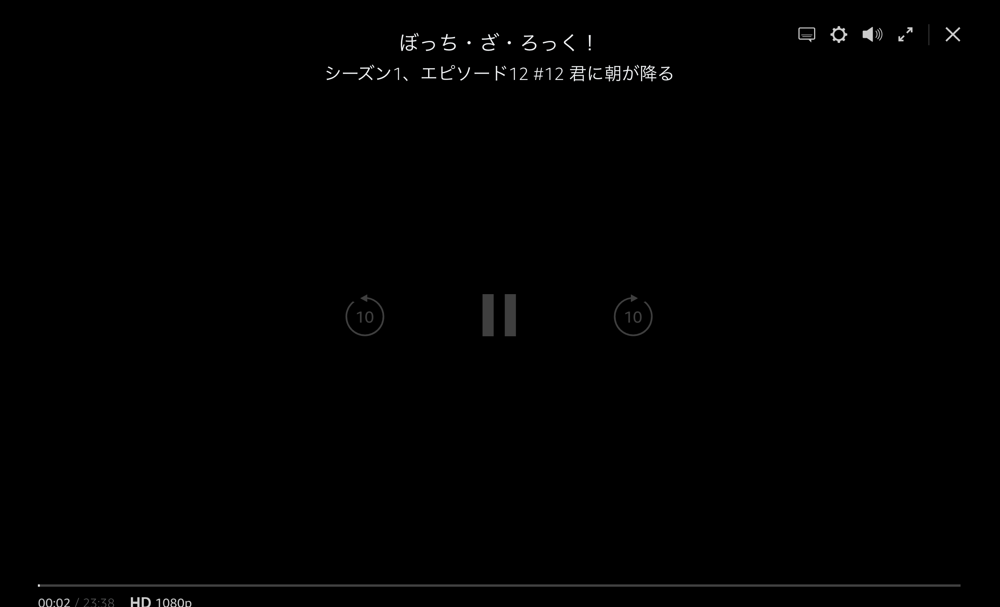

### 概要

---

先日、プライム・ビデオでぼっち・ざ・ろっく！を見ようと動画を再生したところ、動画は映らず音声は正常に再生された。別の動画を試しても同じ状態になる。見れないなら別サイトで見ようかとdアニメストアで再生したが同じ結果になった。

### 遭遇した環境

---

- macOS Monterey バージョン: 12.6
- Google Chrome
- iPad Pro バージョン: 14.7.1

### 結論

---

Sidecarが怪しい
 
有料動画配信サービスを利用するときはSidecarを利用しない。

### わかったこと

---

1. Sidecarが悪さをしているっぽい SidecarはiPadをMacのサブディスプレイにできる機能

2. Youtube、ニコニコ動画では問題ない

3. 参考になったサイトではSafariだけ制限されてEdgeやChromeでは利用できる →自分と少し違う（アップデートで変更があった？）

### 参考

---

* [【Mac】SidecarしているとSafariで有料動画配信を見られない問題](https://kiritsume.com/safari-sidecar-issue/)